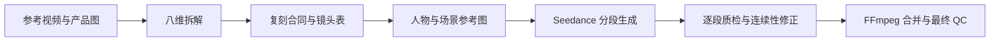

# Recreate Viral Video Skill

一个面向 Codex 的爆款视频拆解与复刻 Skill。它从参考视频中提取可迁移的爆款机制，在替换产品、人物、场景、语言或国家市场后，继续保留原视频的节奏、动作、情绪、冲突、停留与转化逻辑。

## 核心能力

- 按 `hook`、视觉、听觉、停留、情绪冲突、动作表演、说服证明、转化八个维度拆解参考视频。
- 前 3–5 秒强制高密度分析，同时对切点、冲突转折、揭示、证明、回报和 CTA 做局部高密度分析。
- 支持同类产品替换和跨品类复刻，自动适配目标市场的人物、语言和场景。
- 在用户确认授权后，可保留原对白、动作顺序、手势、停顿、表情节奏、走位和标志性表演。
- 可选择当前模型或 Gemini API 拆解视频。
- 使用 Codex 图像生成能力制作原创模特白底图和场景图。
- 编译 Seedance 2.0 多模态请求，支持长视频语义分段、逐段生成、连续性控制和本地合并。
- 所有 API 密钥只从环境变量读取，不写入项目、提示词或日志。

## 工作流



长视频不会被强行压缩进单次生成。Skill 会先报告源视频时长和当前端点上限，再让用户选择精确分段，或由模型提出语义分段并等待批准。最终合并由 Codex 在本地调用 FFmpeg 完成，不是由 Seedance API 完成。

## 安装

将 Skill 复制到 Codex 的个人 Skill 目录：

```bash
mkdir -p ~/.codex/skills
cp -R skill/recreate-viral-video ~/.codex/skills/
```

重新启动 Codex 或刷新 Skill 后，可用“拆解并复刻这个爆款视频”等自然语言触发。

## 运行要求

- Python 3.10+
- `ffmpeg` 与 `ffprobe`：本地抽帧、音轨检查、分段和合并所必需
- Gemini 分析路径：环境变量 `GEMINI_API_KEY`
- Seedance 生成路径：环境变量 `ARK_API_KEY`
- 可用的 Seedance 2.0 Model ID 或 Endpoint ID；Skill 不猜测模型 ID

示例：

```bash
GEMINI_API_KEY=... python3 skill/recreate-viral-video/scripts/gemini_video_analysis.py \
  /path/reference.mp4 \
  --output /path/project/analysis/analysis.json

ARK_API_KEY=... python3 skill/recreate-viral-video/scripts/seedance_task.py \
  /path/project/generation/seedance-request.json \
  --output-dir /path/project/generation \
  --download
```

API 调用可能产生费用。正式提交前应确认端点、分辨率、时长和重试预算。

## 项目结构

```text
skill/recreate-viral-video/
├── SKILL.md                   # 主工作流与行为规则
├── agents/openai.yaml         # Codex Skill 元数据
├── assets/                    # 分析提示词、请求与项目模板
├── references/                # 方法论、长视频、提示词和 API 速查
└── scripts/                   # 分析、校验、分段、生成与合并工具
```

Seedance 参考资料没有复制第三方文档原文。仓库提供官方文档入口和原创接口速查，见 [`references/seedance-official-docs.md`](skill/recreate-viral-video/references/seedance-official-docs.md)。模型参数、价格、限流和可用性可能变化，执行前应以官方最新文档和当前端点为准。

## 权利与安全边界

- 上传参考视频不等于拥有其对白、肖像、声音、音乐、表演或品牌素材的复制权；这些权利需要分别确认。
- 默认生成原创成年人物，不克隆未获授权的真人肖像或声音。
- 产品功效与广告声明必须来自用户可验证的资料。
- 本项目不包含火山引擎、Google 或 OpenAI 的第三方文档原文；商标与文档权利归各自权利人。

## License

项目原创代码、模板与文字采用 [MIT License](LICENSE)。第三方服务、模型和链接内容不受本许可证覆盖。
